## Hi there 👋
I am Riccardo, a Computer engineering student from Livorno, Italy.
Currenty studying at the [University of Pisa](https://unipi.it)
and honorous student at [Sant'Anna School of Advanced Studies](https://santannapisa.it).

 

#### Technologies and languages i use

  
  
  
  
  
  
  
  
  
  
  
  
  
  
  
  
  
  
  
  
  
  
  
  
  
  
  

 

##### You can contact me via the following links

  
  

 

<h5 align="left">Just a really cool snake</h5>

 

